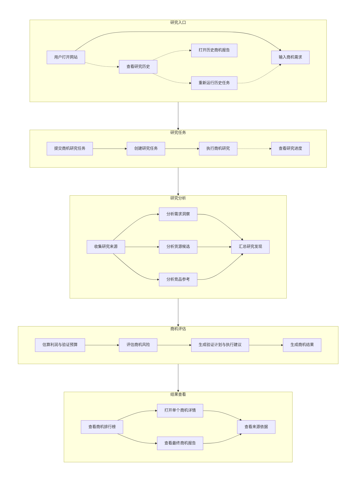

# MarketPilot MVP 路线图

本文档按垂直业务切片整理 MVP 产品需求，供后续 OpenSpec 按切片逐个实现时参考。

## 产品定义

| Field | Content                                                |
| ----- | ------------------------------------------------------ |
| 产品定位  | 商机顾问 Agent，帮助用户从需求信号、供给市场、竞品情况和风险角度，发现能用小成本快速验证的小生意机会。 |
| 演示场景  | 国内商机演示场景，默认围绕类似 1688 的供给市场与中文内容平台。                     |
| 支持语言  | 文案支持中英文文案，默认中文；演示数据使用中文。                               |
| 目标结果  | 用户输入目标和限制条件后，获得 3-5 个商机推荐、每个商机的详情分析，以及一份可执行的验证计划。      |

## 核心业务流程

该流程描述完整 MVP 目标流程；P0 可先跑通基础研究结果，P1 再逐步补强各分析节点和来源透明度。

## 垂直业务切片

| Priority | Definition                                                         |
| -------- | ------------------------------------------------------------------ |
| P0       | 最短可演示闭环。实现后，用户可以从示例或自定义输入开始，完成一次基础商机研究，并获得商机排行、商机详情、最终报告和基础运行观测能力。 |
| P1       | 提升商机判断质量。用于补强需求、货源、竞品、利润、风险、行动建议和来源透明度。                            |
| P2       | 演示体验增强。用于分享、导出等不阻塞核心演示流程的能力。                                       |

## 当前进度

截至 2026-05-31，`bootstrap-project-skeleton`、`bootstrap-product-skeleton`、`create-research-task`、`run-opportunity-research`、`observe-agent-runs`、`show-research-progress`、`polish-ui-ux`、`rank-opportunity-recommendations`、`view-opportunity-detail`、`generate-final-report`、`start-demo-research`、`collect-research-sources`、`show-source-transparency`、`explain-demand-insights`、`introduce-rag-retrieval`、`suggest-supply-candidates`、`compare-competitor-references`、`estimate-validation-budget`、`review-opportunity-risks`、`create-action-plan`、`evaluate-rag-quality` 和 `share-final-report` 已完成实现，`review-opportunity-risks` 已归档到 `openspec/changes/archive/2026-05-31-review-opportunity-risks/`，`create-action-plan` 已归档到 `openspec/changes/archive/2026-05-31-create-action-plan/`，`introduce-rag-retrieval` 已归档到 `openspec/changes/archive/2026-05-31-introduce-rag-retrieval/`，`evaluate-rag-quality` 已归档到 `openspec/changes/archive/2026-05-31-evaluate-rag-quality/`，`share-final-report` 已归档到 `openspec/changes/archive/2026-05-31-share-final-report/`，`project-skeleton`、`product-skeleton`、`research-tasks`、`opportunity-research`、`opportunity-results`、`agent-run-observability`、`research-progress`、`research-sources`、`demand-insights`、`rag-retrieval`、`rag-quality-evaluation`、`supply-candidates`、`competitor-references`、`validation-budgets`、`opportunity-risks`、`action-plans` 与 `report-sharing` 主规格已同步。当前已经跑通“中文示例一键启动或自定义输入 → 创建任务 → 进入任务进度页 → 查看当前运行阶段 → 失败后重新运行 → 完成后进入商机列表/详情/基础报告 → 保存后收集公开来源线索 → 整理任务内 RAG 证据索引 → 生成需求洞察 → 生成货源候选 → 基于任务内检索证据生成竞品参考 → 生成利润与验证预算粗算 → 生成商机风险复核 → 生成行动计划与询盘话术 → 生成报告只读分享链接 → 通过在线分享页浏览报告快照 → 通过来源、RAG 检索、RAG 检索质量评测、需求洞察、货源候选、竞品参考、验证预算、风险复核和行动计划 API 或内部命令读取 → 查看 Agent trace 与阶段事件”的闭环，并补齐了任务上下文导航、移动端卡片列表、真实研究历史入口、可行动空状态、轻量来源透明度 UI、需求洞察展示、任务内 RAG evidence chunks 与 retriever、中文 RAG 检索评测集、P0 检索指标、货源候选展示、竞品参考展示、验证预算展示、风险复核展示、行动计划展示和报告在线分享；基础商机生成阶段仍直接基于任务输入生成结构化商机，不在生成推荐前做外部前置调研、RAG、竞品深挖或多 Agent 协作。下一步可以继续补强 P2 的历史体验，或在后续独立切片中补充索引健康和生成层评测。

| Change                             | Status   | Priority | User Value                                       | MVP Scope                                                                                                                             | Primary Output            | Acceptance Criteria                                                             |
| ---------------------------------- | -------- | -------- | ------------------------------------------------ | ------------------------------------------------------------------------------------------------------------------------------------- | ------------------------- | ------------------------------------------------------------------------------- |
| `bootstrap-project-skeleton`       | complete | P0       | 后续各个 change 可以在统一的项目结构、运行方式和基础配置上继续实现。           | 搭建前端、后端、异步任务、配置文件、环境变量样例和本地依赖服务的项目骨架；只建立基础目录、启动入口和占位结构，不实现具体业务功能、Agent 流程、数据库模型或产品页面。                                                 | 可运行的项目骨架。                 | 项目骨架与技术栈一致；本地能启动基础前端和后端入口；占位结构能支撑后续按垂直切片实现；不包含具体业务流程实现。                         |
| `bootstrap-product-skeleton`       | complete | P0       | 用户首次打开产品时能看到完整的商机顾问产品雏形，并能从清晰入口进入核心演示流程。          | 定义前端产品骨架，包含全局布局、主要页面骨架、页面路由、导航结构、研究入口、结果入口、历史入口和关键空状态；默认中文界面，预留英文 UI 切换位置；只搭建产品级占位与入口，不实现真实研究逻辑。                                           | 可浏览的产品骨架；页面路由；关键入口。       | 首次进入页面展示中文产品界面；用户能看到研究入口、结果/报告入口和历史入口；主要页面路由可访问且有对应骨架内容；关键按钮和导航指向后续 P0 流程；页面不会出现影响理解的英文占位文案。 |
| `create-research-task`             | complete | P0       | 用户能用自然语言或表单描述自己想尝试的生意方向，并创建商机研究任务。               | 支持输入预算、目标渠道、偏好品类、排除品类、目标人群、期望利润、供给来源偏好和其他限制条件；提交后创建商机研究任务。                                                                            | 商机研究任务。                   | 用户能提交类似“预算 5000 元以内，从 1688 找适合小红书种草的产品，不做食品和电子产品”的需求；提交前能看到关键条件；提交后能进入研究任务。     |
| `run-opportunity-research`         | complete | P0       | 用户提交需求后，系统能完成一次基础商机研究，并生成可用于排行榜、详情和报告的商机结果。      | 接收用户输入，生成 3-5 个基础商机结果；每个商机至少包含名称、产品方向、目标人群、推荐理由、适合渠道、价格带、粗略利润空间、风险等级和下一步建议摘要。本 change 不覆盖深度需求、货源、竞品、利润、风险和来源分析，这些能力由后续 P1 changes 补强。 | 基础商机结果；真实商机列表/详情/基础报告摘要。 | 用户提交需求后，任务完成时至少生成 3 个商机；结果能驱动排行榜、详情页和最终报告；示例输入和自定义输入都走同一套研究流程。                  |
| `observe-agent-runs`               | complete | P0       | 演示和排障时能看到每次 Agent 研究任务的执行链路，证明系统不是黑盒，并能快速定位失败原因。 | 为每次商机研究任务记录 trace id、trace URL、阶段状态、耗时、失败原因和基础错误日志；Agent/LangGraph 运行接入 LangSmith tracing；任务记录可关联到对应 trace。                              | Agent 运行 trace；阶段历史；任务日志关联。 | 每次研究任务都有可追踪的 trace id；主要 Agent 节点和 LLM 调用能在 LangSmith 中查看；任务列表可打开 trace 外链；失败任务能定位失败阶段和错误摘要。 |
| `show-research-progress`           | complete | P0       | 用户提交后能知道系统正在做什么，而不是等待黑盒结果。                       | 展示任务状态、当前阶段、已完成阶段、失败原因和重新运行入口。                                                                                                        | 任务进度页。                    | 用户提交任务后能看到运行中状态；完成后进入结果页；失败时能看到可理解的失败原因；失败任务可重新运行。                              |
| `polish-ui-ux`                     | complete | P0       | 用户能更顺手地在任务、进度、商机、报告和历史之间流转，并清楚知道下一步该做什么。      | 打磨全局导航与任务上下文导航、状态驱动主操作、移动端列表、真实历史入口、报告/详情阅读结构和轻量来源展示；不修改数据库迁移、Agent 生成逻辑或来源收集策略。                                                    | 更顺手的核心闭环 UI/UX。            | 桌面和手机端无页面级横向溢出；列表主操作清晰；缺少任务上下文时引导回真实任务闭环；来源失败不阻断报告或详情主体。                    |
| `rank-opportunity-recommendations` | complete | P0       | 用户能快速看到最值得尝试的几个商机。                               | 推荐 3-5 个商机，并给出排序、推荐理由、适合渠道、价格带、利润空间、风险等级和优先级。                                                                                         | 商机排行榜。                    | 每次研究至少输出 3 个商机；每个商机都有名称、产品方向、目标人群、推荐理由、风险等级和推荐优先级。                              |
| `view-opportunity-detail`          | complete | P0       | 用户可以点开单个商机，集中查看该商机的关键判断。                         | 提供商机详情页或详情区域，集中展示单个商机的基本信息、推荐理由、价格带、利润空间、风险等级和下一步建议摘要。                                                                                | 商机详情视图。                   | 用户能从商机排行榜进入任一商机详情；详情中能看懂该商机是什么、为什么推荐、适合谁、风险高低和下一步做什么。                           |
| `generate-final-report`            | complete | P0       | 用户能获得一份完整、可阅读的商机研究报告。                            | 汇总商机排行榜、商机详情摘要、推荐理由、风险等级和下一步行动摘要。                                                                                                     | 商机研究报告。                   | 报告能独立阅读；包含所有推荐商机；有明确的推荐排序和下一步行动摘要。                                              |
| `start-demo-research`              | complete | P0       | 用户可以一键使用默认中文示例开始一次完整商机研究。                        | 提供 2-3 个结构化中文示例需求；用户可点击示例填入表单继续编辑，也可一键创建并启动真实研究任务。                                                                                   | 可启动中文示例入口；真实演示任务。         | 首次访问页面时能看到示例入口；用户无需手写需求也能启动完整演示流程；示例内容符合国内商机顾问场景。                               |
| `collect-research-sources`         | complete | P1       | 用户能看到商机判断不是凭空生成，而是基于收集到的公开信息和摘要。                 | 为每次商机研究收集公开来源，保存来源标题、链接、摘要、关联商机和关联判断类型；来源可用于需求、货源、竞品、风险等后续分析；本切片提供数据层、API 和阶段观测，不实现完整来源透明度 UI。                                            | 研究来源集合；来源读取 API；来源收集阶段事件。 | 研究完成后可保存或明确返回空来源；来源可关联到商机或任务；来源收集失败不会破坏基础商机结果；来源 API 不暴露内部 ID。                       |
| `show-source-transparency`         | complete | P1       | 用户能查看关键结论来自哪里，提高信任感。                             | 展示来源列表，并将已收集来源关联到需求、供给、竞品或风险判断；来源表达为公开线索或初步参考。                                                                                         | 来源列表与研究过程摘要。              | 报告和商机详情可展示来源；来源信息至少包含标题、链接、摘要、类型和支撑强度；缺少来源时不阻断基础结果阅读。                         |
| `explain-demand-insights`          | complete | P1       | 用户能理解每个商机为什么可能有需求。                               | 为每个商机说明目标人群、使用场景、购买动机、内容种草点、趋势信号和季节性因素。                                                                                               | 需求与趋势说明。                  | 每个商机都有需求依据；说明中包含人群、场景、购买动机和种草角度；关键判断能关联来源。                                      |
| `introduce-rag-retrieval`          | complete | P1       | 团队能把已收集公开来源转成当前任务内可检索证据，让竞品参考优先使用可追溯来源。       | 从 `research_sources` 派生 RAG evidence chunks，生成 embedding 并存入 pgvector，提供 task-scoped retriever，在来源收集后建立索引，并先接入竞品参考生成；不做全局知识库、基础商机生成前置 RAG 或正式 RAG 评测。       | RAG evidence chunks；任务内 retriever；竞品参考检索接入；索引/检索 trace metadata。 | 来源收集后可建立或跳过 RAG 索引；检索默认限制在当前任务内；竞品参考优先使用 `competitor`/`general` 证据；RAG 失败不破坏研究闭环。 |
| `evaluate-rag-quality`             | complete | P1       | 团队能用固定中文评测集复跑任务内 RAG retriever，判断证据是否找对、找全并排在前面。   | 建立中文 RAG 检索评测集；保存评测 case、run 和 result；计算 `hit_rate@k`、`recall@k`、`precision@k`、`mrr@k`、`ndcg@k`；接入 LangSmith metadata；提供内部 runner。 | RAG 检索评测集；P0 检索指标；评测运行结果。 | 默认评测集覆盖需求、货源、竞品和风险；可对已完成任务运行评测；结果保存公开来源引用、相关性等级、P0 指标和安全错误摘要；不暴露内部 ID 或完整正文。 |
| `suggest-supply-candidates`        | complete | P1       | 用户能知道这个商机大致可以去哪里找货。                              | 为每个商机提供候选货源方向、可能的供给市场、价格区间、起订量信息、规格/材质/款式参考和需要向供应商确认的问题。                                                                              | 货源候选列表。                   | 每个商机至少包含 2 个货源候选方向或候选商品；展示价格区间和起订量信息；明确需要进一步确认的问题。                              |
| `compare-competitor-references`    | complete | P1       | 用户能判断市场上有没有类似产品，以及差异化空间在哪里。                      | 展示类似产品示例、常见售价区间、常见卖点、同质化程度和差异化切入点。                                                                                                    | 竞品与价格参考。                  | 每个商机都有竞品/类似产品参考；包含售价区间、常见卖点和差异化建议。                                              |
| `estimate-validation-budget`       | complete | P1       | 用户能粗略判断这个商机是否值得用小预算验证。                           | 输出预估拿货成本、预估售价、粗略毛利空间、首批验证数量、首批验证预算和关键验证假设。                                                                                            | 利润与验证预算粗算。                | 每个商机都有成本、售价和毛利空间估算；给出首批验证预算；明确至少 1 个最需要验证的假设。                                   |
| `review-opportunity-risks`         | complete | P1       | 用户能提前看到不适合做或需要谨慎验证的风险。                           | 覆盖产品质量、发货履约、售后、合规、库存积压、同质化竞争和平台规则风险。                                                                                                  | 风险提示。                     | 每个商机都有风险等级和风险说明；至少覆盖质量、履约、售后和竞争风险；风险说明具体到可行动建议。                                 |
| `create-action-plan`               | complete | P1       | 用户能知道下一步该怎么开始验证。                                 | 为每个商机生成首批验证计划、选品验证方式、内容种草角度、商品标题/卖点建议、供应商询盘话术和上架前检查清单。                                                                                | 验证计划与执行建议。                | 每个商机都有下一步行动；包含询盘话术和上架前检查清单；验证计划能在小预算下执行。                                        |
| `browse-research-history`          | complete | P2       | 用户能回看之前完成或失败的商机研究任务，方便继续查看演示案例和历史结果。             | 提供研究历史列表，展示任务标题、创建时间、状态和入口；用户可以打开已完成任务的报告，或重新运行失败/历史任务。                                                                               | 研究历史列表。                   | 用户能看到历史研究任务；能打开已完成任务；能识别任务状态；能从历史任务进入报告或重新运行入口。                                 |
| `share-final-report`               | complete | P2       | 用户能把最终报告发给他人，对方无需下载文件即可在线阅读。                     | 为已生成商机结果的研究任务创建只读分享链接；保存报告快照；支持任务内查看分享记录、复制链接、打开分享页和撤销分享；撤销时一次关闭当前任务所有可访问分享；公开页展示任务摘要、商机详情、增强分析、来源线索和谨慎边界说明，不展示运行、编辑、调试或删除入口。             | 在线只读报告分享页。                | 生成链接后可通过 `/share/reports/[token]` 在线浏览；撤销后公开链接不可访问；旧分享快照不被重新运行覆盖；公开响应不暴露内部 ID、run/trace、阶段事件或内部配置。 |

## MVP 不做

| Item      | Reason                          |
| --------- | ------------------------------- |
| 自动下单      | 涉及交易和平台账号，MVP 先不覆盖。             |
| 自动联系供应商   | 涉及对外沟通，MVP 先提供询盘话术。             |
| 自动发布内容    | 涉及平台账号和内容分发，MVP 先提供文案建议。        |
| 登录后平台数据抓取 | 涉及账号、权限和反爬复杂度，MVP 先使用公开信息和演示数据。 |
| 支付系统      | 与商机顾问核心验证无关。                    |
| 团队协作      | 单用户演示优先。                        |
| 复杂经营看板    | MVP 聚焦一次商机研究闭环。                 |
| 精确财务模型    | MVP 只做粗略利润和验证成本估算。              |
